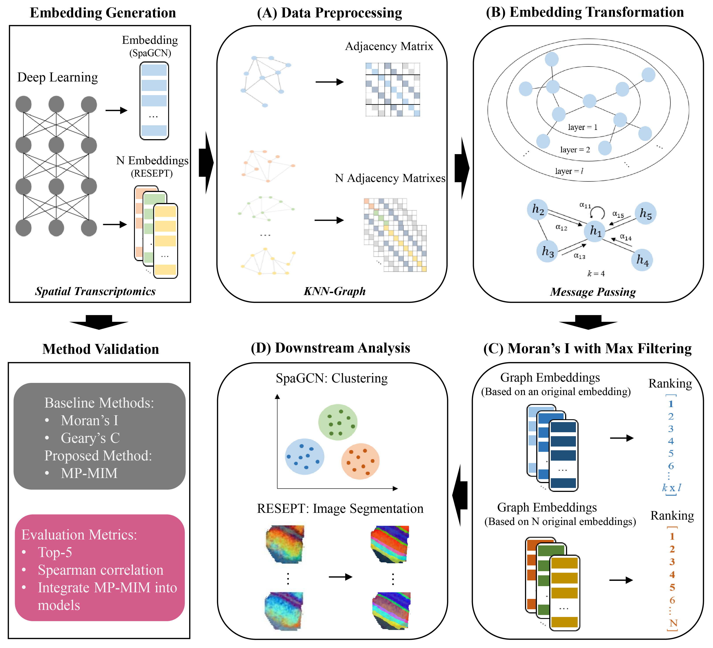

# MP-MIM

## An evaluation method for single-cell spatial data embedding in tissue architecture identification

MP-MIM is a novel embedding evaluation method that employs a graph convolution way for message passing and spatial autocorrelation index to evaluate embeddings from deep learning models used for spatial transcriptomics analysis. It can accurately evaluate multiple embeddings with different hyperparameter settings and identify high-quality embeddings by producing a high correlation between the predicted spatial architecture and the ground truth. The main workflow of MP-MIM is shown as follows:


As shown in (A), (B), and (C), the process starts from converting the input to KNN-Graph data with a graph structure. Message passing based on graph convolution transforms the native embedding with KNN-Graph structure to graph embedding. The multiple transformed embeddings are evaluated by Moran’s I with maximum filtering based on all the dimensions of each embedding. Finally, the graph embeddings and quality ranking are output for the downstream analysis in their respective models.

--------------------------------------------------------------------------------

## System Requirements:

MP-MIM was implemented on a computing server with 2.2 GHz, 144 cores CPU, and 503 GB RAM under an ubuntu 18.04 operating system.

### OS Requirements: 

MP-MIM can run on both Linux and Windows. The package has been tested on the Linux system.

### Install MP-MIM from Github:

```bash
git clone https://github.com/YuLin-code/MP-MIM.git
```

### Python Dependencies: 

MP-MIM mainly depends on the Python (3.6+) scientific stack and python virutal environment with conda (<https://anaconda.org/>) is recommended.

```shell
conda create -n MP_MIM python=3.8.8 pip
conda activate MP_MIM
pip install -r requirements.txt
```

### Configure RESEPT Environment:

Download and install [RESEPT](https://github.com/OSU-BMBL/RESEPT). Generate embedding and conduct tissue architecture identification. 

### Configure SpaGCN Environment:

Download and install [SpaGCN](https://github.com/jianhuupenn/SpaGCN). Integrate MP-MIM into SpaGCN and conduct tissue architecture identification. 


## Demo:

### 1. Set Baseline

The deep learning model RESEPT was used as an embedding sampling method to generate embeddings. 56 three-dimensional embeddings with different hyperparameter settings were generated and saved in the source code folder for 16 samples. Run the following command to generate the ground truth ranking and we take '151507' as the example sample.

```bash
cd RESEPT
python Embedding_Ground_Truth_Quality_Rank.py --sampleName 151507
```

### 2. MP-MIM Rank

We take an example of an analysis when k_num is 90 and l_num is 15 in MP-MIM. Here we use hyperparameters to demo purposes:

- **MP-k-num** defines the number of nearest neighbors in the KNN graph.
- **MP-l-num** defines the number of iteration in message passing. 

If you want to reproduce results in the manuscript, please use default hyperparameters.

```bash
python MP_MIM_RESEPT.py --sampleName 151507 --MP-l-num 15 --MP-k-num 90
```

### 3. Spearman Correlation Analysis

MP-MIM can accurately identify the embeddings with different qualities by producing a high correlation between the output ranking and the ground truth. Run the following command line to calculate Spearman correlation: 

```bash
python Spearman_Correlation.py --sampleName 151507 --MP-l-num 15 --MP-k-num 90
```

### 4. Integrate MP-MIM into SpaGCN

The native SpaGCN and the SpaGCN integrated MP-MIM versions are in the source code. Please put the original dataset that contains the spatial and metadata information of each sample into the path of running SpaGCN with supporting for tissue architecture identification. Run the following command line to obtain the ARI of each SpaGCN version: 

```bash
cd ../SpaGCN/Native_SpaGCN
python SpaGCN_Native.py --sampleName 151507
cd ../SpaGCN_MP_MIM
python SpaGCN_MP_MIM.py --sampleName 151507
```

More information can be checked at the [tutorial](https://github.com/YuLin-code/MP-MIM/tree/master/tutorial).

## References:

1. VAE <https://github.com/pytorch/examples/tree/master/vae>
2. GAE <https://github.com/tkipf/gae/tree/master/gae>
3. Moran’s I and Geary's C <https://github.com/pysal>
4. RESEPT <https://github.com/OSU-BMBL/RESEPT>
5. SpaGCN <https://github.com/jianhuupenn/SpaGCN>
